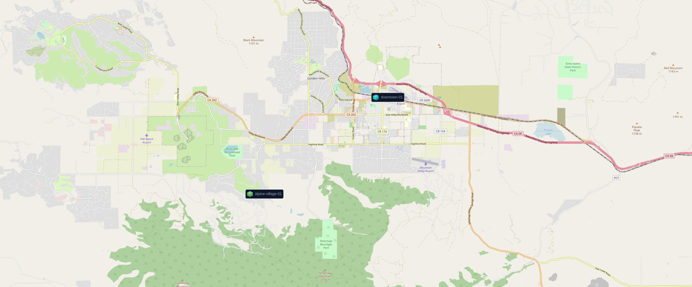

# Well Known Nodes

## Downtown Tehachapi

### `dt01` / `downtown-01`

Operates from downtown, historically stable and backed by a UPS unit. The
antenna placement is sub-optimal, but seems to generally get about a mile
of coverage.

- **Hardware:** [2019 LILYGO T-Beam T22 v1.1](https://meshtastic.org/docs/hardware/devices/tbeam/?t-beam=1.1)
- **Software:**  [Meshtastic Firmware v2.4.2.5b45303](https://github.com/meshtastic/firmware/releases/tag/v2.4.2.5b45303)
- **Mode:** `CLIENT`

Software gets updated along the Beta channel semi-frequently, and this documentation does not automatically update.

## Alpine Forest

### `av01` / `alpine-village-01`

Operates from the South East side of Alpine Forest (sometimes called Alpine
Village), near Indian Hills Campground, that's generally stable and backed
by a UPS unit. The antenna placement is sub-optimal. This is in a small valley
base, so coverage is limited.

- **Hardware:** [2019 LILYGO T-Beam T22 v1.1](https://meshtastic.org/docs/hardware/devices/tbeam/?t-beam=1.1)
- **Software:**  [Meshtastic Firmware v2.4.2.5b45303](https://github.com/meshtastic/firmware/releases/tag/v2.4.2.5b45303)
- **Mode:** `CLIENT`

Software gets updated along the Beta channel semi-frequently, and this documentation does not automatically update.

### `rs04` / `rak-solar-04` 

Sometimes `rs05` / `rak-solar-05`.

Operates from the South East side of Alpine Forest (sometimes called Alpine
Village), near Indian Hills Campground. Solar powered with an external
fiberglass antenna. Undergoing testing for permanent installation, but
I'll need to see how it does over the winter.

- **Hardware:** [2024 RAK4631](https://meshtastic.org/docs/hardware/devices/rak/)
- **Software:**  Close to [Meshtastic Firmware v2.4.2.5b45303](https://github.com/meshtastic/firmware/releases/tag/v2.4.2.5b45303). (Need to check)
- **Mode:** `CLIENT` (Slated to change to `REPEATER`)

Software gets updated along the Beta channel semi-frequently, and this documentation does not automatically update.
